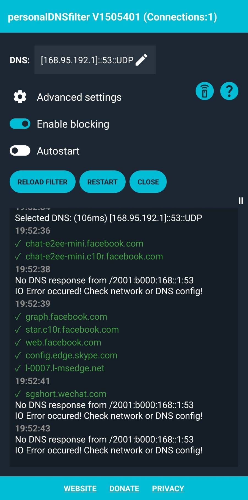

#  在 Android 平台上排除與 Workspace ONE 有關的問題

## 內容摘要
- 針對在納管 Android 裝置時常遇到的問題提供建議的工具及補充的說明：
  1. 網路（用來確認基礎環境及配置是否正確）
  2. 名稱解析（用來確認基礎環境及配置是否正確）
  3. 防火牆（這是最常會遇到的基礎環境及配置上的挑戰）
- 提供參考資料便於進一步研讀細節及原理

## 準備工作

### 所需設備

-  一台 Android 設備（需要啟動偵錯模式）
-  一台可執行 Android Debug Bridge (adb) 的設備(Windows, macOS, Linux, and Chrome OS)

### 安裝工具（用於圖形介面的除錯）

請依參考資料中的連結安裝如下除錯工具：

- Ping & Net - Apps on Google Play
- personalDNSfilter - Apps on Google Play

### 準備 Android 除錯環境（用於文字介面的除錯）

請依參考資料中的連結在您要用來執行 Android Debug Bridge (adb) 的設備上安裝 adb 。

## 查找網路連線相關的問題

### 使用圖形介面

在 Android 設備上使用 Ping & Net 工具利用 [Traceroute] 或 [HTTP Headers] 的功能測試與目的地主機（以名稱或 IP）的連線是否正常。因為使用上相當直覺，在本文中就省略相關使用方法的描述。在這裹強力推薦使用一下 [HTTP Headers] 的功能，它真的很好用！因為現在有很多的應用都是透過 HTTP/HTTPS 協定進行的。如下為主選單範例：


### 使用文字介面

首先使用 USB 線連接要執行 adb 的設備及要除錯的 Android 設備。在連接後，執行如下指令進入除錯設備的命令提示列：

``` shell
adb shell
```

使用如下指令確認路由設定：

``` shell
netstat -r
```

輸出：
```
Kernel IP routing table
Destination	Gateway 	Genmask 	Flags   MSS Window  irtt Iface
10.0.2.0        *               255.255.255.0   U         0 0          0 tun0
10.20.30.40     *               255.255.255.252 U         0 0          0 rmnet_data2
```

使用如下指令確認 IPv4 的路由：

``` shell
ip -4 route show
```

輸出：
```
10.0.2.0/24 dev tun0 proto kernel scope link src 10.0.2.15
10.20.30.40/30 dev rmnet_data2 proto kernel scope link src 10.20.30.42
```

使用如下指令確認 IPv6 的路由：

``` shell
ip -6 route show
```

輸出：
```
...略...
```

使用如下指令確認 IPv4 的 IP 位址：

``` shell
ip -4 address
```

輸出：
```
1: lo: <LOOPBACK,UP,LOWER_UP> mtu 65536 qdisc noqueue state UNKNOWN group default qlen 1000
    inet 127.0.0.1/8 scope host lo
       valid_lft forever preferred_lft forever
12: rmnet_data2@rmnet_ipa0: <UP,LOWER_UP> mtu 1500 qdisc htb state UNKNOWN group default qlen 1000
    inet 10.20.30.42/30 scope global rmnet_data2
       valid_lft forever preferred_lft forever
38: tun0: <POINTOPOINT,UP,LOWER_UP> mtu 3000 qdisc pfifo_fast state UNKNOWN group default qlen 500
    inet 10.0.2.15/24 scope global tun0
       valid_lft forever preferred_lft forever
```

使用如下指令確認 IPv6 的 IP 位址：

``` shell
ip -6 address
```

輸出：
```
1: lo: <LOOPBACK,UP,LOWER_UP> mtu 65536 state UNKNOWN qlen 1000
    inet6 ::1/128 scope host
       valid_lft forever preferred_lft forever
3: dummy0: <BROADCAST,NOARP,UP,LOWER_UP> mtu 1500 state UNKNOWN qlen 1000
    inet6 fe80::9057:dbff:fe62:523d/64 scope link
       valid_lft forever preferred_lft forever
10: rmnet_data0@rmnet_ipa0: <UP,LOWER_UP> mtu 1500 state UNKNOWN qlen 1000
    inet6 fe80::ed87:b7bf:e893:8755/64 scope link
       valid_lft forever preferred_lft forever
38: tun0: <POINTOPOINT,UP,LOWER_UP> mtu 3000 state UNKNOWN qlen 500
    inet6 fdc8:1095:91e1:aaaa:aaaa:aaaa:aaaa:aaa2/48 scope global
       valid_lft forever preferred_lft forever
    inet6 fe80::3d70:d3f5:1f7:8c8e/64 scope link stable-privacy
       valid_lft forever preferred_lft forever
```

## 查找名稱解析相關的問題

### 使用圖形介面

在 Android 設備上使用 personalDNSfilter 觀察在使用過程中 DNS 名稱解析的要求。因為使用上相當直覺，在本文中就省略相關使用方法的描述。第一個重點是依參考資料清除 Android 設備上的 DNS 快取。第二個重點是在觀察的過程中操作的功能越單純越好，透過 DNS 名稱解析的要求，您可以知道 Android 設備準備連線到那裹。當然，若有些服務是直接使用 IP 位址或主機表 hosts 定義的 IP 位址，那您是不會看到 DNS 名稱解析的要求。第三個重點是花點時間了解一下什麼是 CNAME。如下為主選單範例：



如下則是在納管的 Android 設備上實際觀察到的名稱解析過程。相關的解讀就留給您當練習：

```
****This is personalDNSfilter V+1505401****
 
Initializing ...
08:14:32
***Initializing personalDNSfilter Version 1505401!***
Using directory: /storage/emulated/0/Android/data/dnsfilter.android/files/PersonalDNSFilter/
08:14:33
Acquired WIFI lock and partial wake lock!
Released WIFI lock and partial wake lock!
Using blocking mode!
VPN connected!
VPN runner thread 1 started!
✓  infinitedata-pa.googleapis.com
✓  android-context-data.googleapis.com
✓  time.android.com
Selected DNS: (93ms) [2001:b400:e204:1010::96]::53::UDP
08:14:34
DNS filter: Next filter reload:Thu Jan 01 08:00:00 GMT+08:00 1970
DNS filter: Reloading hosts filter ...
08:14:42
✓  mtalk.google.com
✓  mobile-gtalk.l.google.com
08:14:43
Updating filter completed!
Released WIFI lock and partial wake lock!
Acquired WIFI lock and partial wake lock!
Reading filter file and building index...!
Building index for 207346 entries...!
08:14:45
Persisting index for 207346 entries...!
Index contains 197321 unique entries!
Processing new filter file completed!
Reloading hosts filter ... completed!
DNS filter: Next filter reload:Wed Jul 12 08:14:45 GMT+08:00 2023
08:14:50
✓  android-safebrowsing.google.com
✓  sb.l.google.com
08:15:01
✓  eventproxy.na1.data.vmwservices.com
08:15:03
✓  ds2103.awmdm.com
✓  jp02pgroup1.awmdm.com
✓  clients2.google.com
✓  clients.l.google.com
08:15:08
✓  connectivitycheck.gstatic.com
08:15:13
✓  signing.awmdm.com
✓  firebaseinstallations.googleapis.com
✓  api.na1.region.data.vmwservices.com
08:15:14
✗  app-measurement.com
08:15:15
✓  rmjp01.awmdm.com
✓  android.apis.google.com
✓  clients.l.google.com
08:15:32
✓  play.googleapis.com
08:16:01
✓  eventproxy.na1.data.vmwservices.com
08:16:03
✓  beacons4.gvt2.com
08:16:16
✗  app-measurement.com
08:17:23
✗  app-measurement.com
08:18:32
✓  play.googleapis.com
08:19:00
✗  app-measurement.com
08:19:10
✓  infinitedata-pa.googleapis.com
08:22:17
✗  app-measurement.com
08:24:05
```

### 使用文字介面

首先使用 USB 線連接要執行 adb 的設備及要除錯的 Android 設備。在連接後，執行如下指令進入除錯設備的命令提示列：

``` shell
adb shell
```

如下指令可查詢 DNS 的配置：

``` shell
getprop | grep dns
```

## 查找防火牆相關的問題

針對防火牆的配置，在完美的情況，理論上如下的組合應可順利完成所需的防火牆配置及驗證：
1. 有一份完整及正確的防火牆開放規則清單。
2. 有一防火牆管理者可以協助您觀察那些連線被阻擋及配合測試、調整、驗證。

但往往因為不同的因素，設備仍是無法正常的連接到所需要連接的服務。如下介紹的方式是從端點來蒐集連線被阻擋的資訊，如此可以更精準的提供防火牆管理者所需的資訊：具體有那些連線被阻擋。這個技巧可以讓您成為網路管理者或防火牆管理者的好朋友，因為您是「有備而來」，用具體的資訊及相關的網路術語描述您遇到的問題。要注意的是，這需要在網路、DNS 名稱解析的基礎環境及配置都確認後才進行這一步的測試。

整個除錯過程應用的主要原理在於蒐集持續是 SYN_SENT 狀態的連線，和使用 telnet 連接特定 IP 地址及連接埠的原理一樣，也和使用 Ping & Net 中 [HTTP Headers] 的功能一樣。它們都會觸發 SYN_SENT。但差別是，若您不知道設備是會連到那些 IP 地址及連接埠，那要怎麼辦？或是要連的 IP 地址及連接埠有那麼多，那要怎麼辦？

如下的程序可以具體蒐集一些有用的資訊協助您：

### 使用文字介面

在 macOS 或 Linux 輸入如下指令將螢幕輸出同時記錄到檔案。關於 script 指令可以從參考資料中找到相關的介紹。在 Windows 中也可以透過 Cygwin 使用類以 Unix/Linux 的環境。

``` shell
script `date +%Y-%m-%d-%H%M%S`.log
```

首先使用 USB 線連接要執行 adb 的設備及要除錯的 Android 設備。在連接後，執行如下指令進入除錯設備的命令提示列：

``` shell
adb shell
```

先執行如下指令看看是否能正常蒐集到資料，一段時間後可輸入 \<ctrl-c\> 中斷執行：

``` shell
while sleep 1
do
    date +%Y-%m-%d-%H%M%S
    netstat -Wn | egrep '(CLOSE_WAIT|ESTABLISHED|SYN_SENT)'
done
```

```
2023-07-30-171717
tcp        0      0 10.20.30.41:40502                                   142.251.43.10:443                                   ESTABLISHED
tcp        0      0 10.20.30.41:38738                                   142.251.43.4:443                                    ESTABLISHED
tcp        0      0 10.20.30.41:37882                                   142.251.43.3:443                                    ESTABLISHED
tcp        0      0 10.20.30.41:44228                                   172.217.160.74:443                                  ESTABLISHED
tcp6      32      0 ::ffff:10.20.30.41:42452                            ::ffff:54.200.0.209:443                             CLOSE_WAIT
tcp6       0      0 ::ffff:10.20.30.41:44310                            ::ffff:172.217.160.74:443                           ESTABLISHED
tcp6      32      0 ::ffff:10.20.30.41:38914                            ::ffff:18.176.78.85:443                             CLOSE_WAIT
tcp6       0      0 ::ffff:10.20.30.41:44224                            ::ffff:172.217.160.74:443                           ESTABLISHED
tcp6      32      0 ::ffff:10.20.30.41:38918                            ::ffff:18.176.78.85:443                             CLOSE_WAIT
tcp6      32      0 ::ffff:10.20.30.41:38876                            ::ffff:18.176.78.85:443                             CLOSE_WAIT
tcp6       0      0 ::ffff:10.20.30.41:38196                            ::ffff:172.217.160.67:443                           ESTABLISHED
tcp6       0      0 ::ffff:10.20.30.41:44312                            ::ffff:172.217.160.74:443                           ESTABLISHED
tcp6       0      0 ::ffff:10.20.30.41:37944                            ::ffff:142.251.43.3:443                             ESTABLISHED
tcp6       0      0 ::ffff:10.20.30.41:44190                            ::ffff:74.125.23.188:5228                           ESTABLISHED
tcp6      32      0 ::ffff:10.20.30.41:38920                            ::ffff:18.176.78.85:443                             CLOSE_WAIT
tcp6      32      0 ::ffff:10.20.30.41:38922                            ::ffff:18.176.78.85:443                             CLOSE_WAIT
udp        0      0 10.20.30.41:45348                                   142.251.43.3:443                                    ESTABLISHED
```

輸入如下指令，然後開始 Android 設備的操作，並觀察是否有「持續」為 SYN_SENT 的連線：

``` shell
while sleep 1
do
    date +%Y-%m-%d-%H%M%S
    netstat -Wn | egrep '(SYN_SENT)'
done
```

輸出：
```
2023-07-30-171717
tcp6       0      1 ::ffff:10.20.30.4:49960                             ::ffff:44.239.101.2:443                             SYN_SENT
```

如上的例子，可以看到若「持續」看到同一目的 IP 位址一直都是 SYN_SENT ，那它有可能是被阻擋了！在蒐集一斷時間後，您可以使用 \<ctrl-c\> 中斷執行。

然後輸入如下指令離開 adb：

``` shell
exit
```

並且輸入如下指令離開 script：

``` shell
exit
```

此時可以檢視新增的 .log 檔案。

## 參考資料

### 工具
- [Ping & Net - Apps on Google Play](https://play.google.com/store/apps/details?id=com.ulfdittmer.android.ping)
- [personalDNSfilter - Apps on Google Play](https://play.google.com/store/apps/details?id=dnsfilter.android&hl=en&gl=US)

### 文件
 
#### Android Debug Bridge (adb)

[設定裝置端開發人員選項  |  Android Studio  |  Android Developers](https://developer.android.com/studio/debug/dev-options?hl=zh-tw)

[Android Debug Bridge (adb)  |  Android Studio  |  Android Developers](https://developer.android.com/tools/adb)

[How to Install ADB on Windows, macOS, Linux, and Chrome OS | Beebom](https://beebom.com/how-to-install-adb-windows-mac/)

[《十分鐘學程式》ADB (Android Debug Bridge) 常用 Command-line](https://notcodingwilldie.blogspot.com/2018/02/adb-android-debug-bridge-command-line.html)

[《十分鐘學程式》Android 環境建置 -- Windows 10 上安裝 adb](https://notcodingwilldie.blogspot.com/2018/02/android-windows-10-adb.html)

#### PING

[ping - 維基百科，自由的百科全書](https://zh.wikipedia.org/zh-tw/Ping)

[☆分享-幾個常用網路測試命令 - iT 邦幫忙::一起幫忙解決難題，拯救 IT 人的一天](https://ithelp.ithome.com.tw/articles/10029163)

#### DNS

[3 Best Ways to Display the Contents of Your DNS Cache - wikiHow](https://www.wikihow.com/Display-the-Contents-of-Your-DNS-Cache)

[How to flush DNS cache | AdGuard DNS Knowledge Base](https://adguard-dns.io/kb/zh-TW/public-dns/solving-problems/how-to-flush-dns-cache/)
 
[App which gives log of all http or DNS requests made by applications : r/androidapps](https://www.reddit.com/r/androidapps/comments/nhgozd/app_which_gives_log_of_all_http_or_dns_requests/)

[CNAME記錄 - 維基百科，自由的百科全書](https://zh.wikipedia.org/zh-tw/CNAME%E8%AE%B0%E5%BD%95)

#### TCP/IP
[TCP連接的狀態詳解以及故障排查 - 壹讀](https://read01.com/zh-tw/5BLkAG.html)

[VMware Workspace ONE IP ranges for SaaS data centers (2960995)](https://kb.vmware.com/s/article/2960995)

#### Shell

[script (Unix) - Wikipedia](https://en.wikipedia.org/wiki/Script_(Unix))

[Cygwin - Get that Linux feeling - on Windows](https://www.cygwin.com/)
